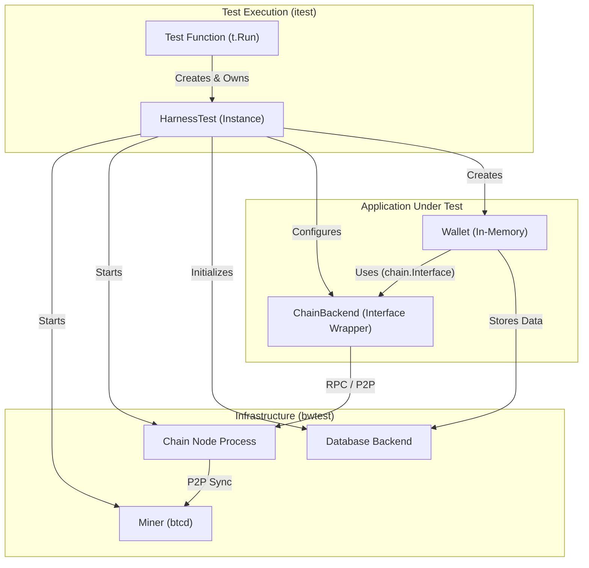

# ADR 0008: Integration Test Framework

## 1. Context

The `btcwallet` project requires a robust integration testing framework to verify the correctness of its core `wallet` package against various configurations. The current testing landscape is insufficient for verifying the complex matrix of supported backends and modes.

There is a requirement to support:
1.  **Multiple Chain Backends**: `btcd` (native), `bitcoind` (external process), and `neutrino` (SPV).
2.  **Multiple Database Backends**: `kvdb` (bbolt/etcd), `sqlite`, and `postgres`.
3.  **Public API Testing**: Verifying the public methods of the `wallet` package (e.g., `Create`, `Load`, `Start`, `Stop`).

We need a standardized, reusable approach to write integration tests that can run across all these permutations without duplicating setup logic.

## 2. Decision

We will implement a modular integration test framework modeled after `lnd`'s `lntest`, adapted for library-mode testing.

### 2.1. Library-Mode Testing
Tests will run `btcwallet` in **Library Mode** (in-process).
- **Why**: Faster execution, easier debugging, and direct internal state assertion.
- **How**: The test harness instantiates `wallet.Manager` directly.

### 2.2. Architecture & Components

The framework is split into `bwtest` (framework) and `itest` (test cases).

#### Component Interaction



*   **`Miner`**: A dedicated `btcd` instance responsible for generating blocks. It acts as the source of truth for the blockchain state.
*   **`Chain Node`**: The software providing chain data (`btcd`, `bitcoind`).
    *   For `btcd` tests: A separate `btcd` process is started as the Chain Node and connects to the Miner.
    *   For `bitcoind` tests: A separate `bitcoind` process connects (P2P) to the Miner to sync.
    *   For `neutrino` tests: There is no separate "Chain Node" process; Neutrino connects directly to the Miner.
*   **`ChainBackend`**: The interface wrapper (`rpcclient` or `neutrino.ChainService`) used by the Wallet to communicate with the Chain Node.
*   **`Database Backend`**: The storage layer (`kvdb`, `postgres`, `sqlite`).
*   **`HarnessTest`**: The specific test instance. It manages unique ports, temp directories, and process lifecycles.

### 2.3. Package Structure

- **`bwtest/`**:
    - `harness.go`: `HarnessTest` orchestrator. Manages `t.Cleanup` for resource teardown.
    - `chain_backend.go`: Logic to start/stop `btcd`/`bitcoind` processes and configure `neutrino`.
    - `miner.go`: `Miner` implementation (controls the primary `btcd` instance).
    - `database.go`: Helpers to setup/teardown DBs (create temp bolt files, init SQL schemas).
- **`itest/`**:
    - `main_test.go`: Flag parsing (`-chain`, `-db`) and global test runner.
    - `manager_test.go`: Test cases for `wallet.Manager`.

### 2.4. Configuration & Isolation

Configuration is handled via `go test` flags.

```bash
# Default (btcd + kvdb)
make itest

# Explicit configuration
make itest chain=bitcoind db=postgres

# Run specific test case
make itest case=TestNewWallet
```

*   **Sequential Execution**: Tests run sequentially to avoid resource exhaustion and port conflicts, given the heavy overhead of spinning up multiple full nodes per test.
*   **Neutrino Support**: The `Miner` (btcd) will be configured with `--cfilters` to serve compact block filters, allowing Neutrino clients to connect directly to it for SPV synchronization.

## 3. Implementation Plan

1.  **Scaffold Framework (`bwtest`)**:
    - Implement `Miner` (wraps `rpctest`).
    - Implement `ChainBackend` logic (start bitcoind/btcd process, setup neutrino).
    - Implement `Database` setup (init postgres schema, temp sqlite files).
    - Implement `HarnessTest` to orchestrate the dependency graph:
      `Miner -> ChainNode -> ChainBackend -> DB -> Wallet`.
2.  **Scaffold Tests (`itest`)**:
    - Create `manager_test.go` as a proof-of-concept.
3.  **CI Integration**:
    - Update `Makefile` with `itest` targets mapping flags correctly.

## 4. Consequences

### Pros
- **Consistency**: Clear separation between Network, Infrastructure, and Application.
- **Isolation**: Per-test harnesses prevent state leaks.
- **Coverage**: capable of validating the entire support matrix.

### Cons
- **Resource Intensity**: Running a separate `bitcoind`/`btcd` process per test is CPU/RAM intensive.
- **Complexity**: Dynamic port allocation and process lifecycle management are error-prone.
- **Execution Time**: Tests will take longer to run due to sequential execution and process startup costs.
