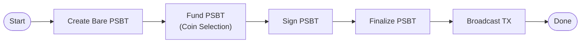
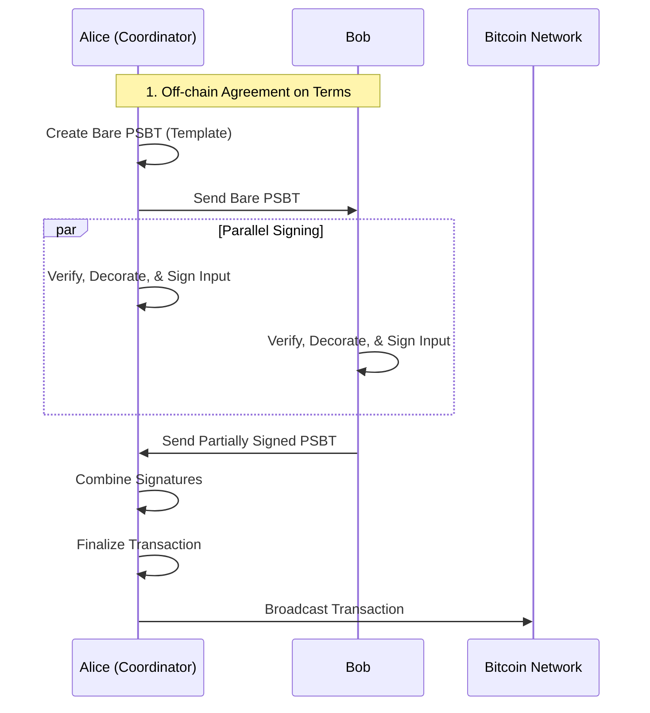

# PSBT Workflows Guide

This document provides a guide to creating Bitcoin transactions using the
`PsbtManager` interface. We will explore several scenarios, from a simple
single-person payment to a more complex, multi-party collaborative transaction,
highlighting best practices for security and efficiency.

Our actors:
- **Alice**: A user of `btcwallet`.
- **Bob**: Another user of `btcwallet`.
- **Carol**: The recipient of the payments.

---

## Scenario 1: Simple Single-Signer Transaction (Alice Pays Carol)

This is the most common use case: a single user creating a transaction from their
own wallet. The workflow is linear and straightforward.

**Goal:** Alice wants to pay 1 BTC to Carol.



### Workflow Steps

1.  **Create a Bare PSBT:** Alice's application first creates a bare PSBT that
    describes the intended output.

    ```go
    import "github.com/btcsuite/btcwallet/wallet"
    
    carolOutput := &wire.TxOut{Value: 100_000_000, PkScript: carolPkScript}
    packet, err := wallet.CreatePsbt(nil, []*wire.TxOut{carolOutput})
    ```

2.  **Fund the PSBT:** Alice's wallet performs coin selection to add inputs and a
    change output.

    ```go
    fundIntent := &wallet.FundIntent{
    		Packet: packet,
    		Policy: &wallet.InputsPolicy{
    			Source: &wallet.ScopedAccount{
    				AccountName: "default",
    				KeyScope:    waddrmgr.KeyScopeBIP0086,
    			},
    			MinConfs: 1,
    		},
    		FeeRate: btcunit.NewSatPerKVByte(1000), // e.g., 1 sat/vb
    	}
    
    	fundedPacket, _, err := aliceWallet.FundPsbt(ctx, fundIntent)
    
    ```
    
    The `fundedPacket` now contains the necessary inputs (fully decorated) and a change output.
    
3.  **Sign the PSBT:** The wallet signs all inputs it has the keys for.

    ```go
    signParams := &wallet.SignPsbtParams{Packet: packet}
    _, err = aliceWallet.SignPsbt(ctx, signParams)
    ```

4.  **Finalize and Broadcast:** Alice finalizes the PSBT to produce a complete,
    valid transaction and broadcasts it.

    ```go
    err = aliceWallet.FinalizePsbt(ctx, packet)
    finalTx, err := psbt.Extract(packet)
    err = aliceWallet.Broadcast(ctx, finalTx, "Payment to Carol")
    ```

### Analysis

-   **Round Trips:** 0 (all operations are local to Alice's wallet).
-   **Security:** High. Alice controls the entire process, so there is no risk
    of external manipulation.

---

## Scenario 2: Collaborative Transaction (Alice and Bob Pay Carol)

This is a more advanced workflow where multiple parties contribute inputs to a
single transaction. This requires careful coordination to ensure security.

**Goal:** Alice and Bob want to jointly pay Carol.

We will explore two models for this: a naive (and insecure) model, and the
recommended, secure Coordinator Model.

### The Naive (and Insecure) Independent Funding Model - **DO NOT USE**

In this model, participants create their contributions independently and a
coordinator merges them.

1.  **Alice Funds:** Alice creates a PSBT that pays Carol her portion.
    `aliceWallet.FundPsbt(...)` -> `packet_alice`
2.  **Bob Funds:** Bob does the same. `bobWallet.FundPsbt(...)` -> `packet_bob`
3.  **Coordinator Combines:** A coordinator merges these.
    `combinedPacket, _ := wallet.CombinePsbt(ctx, packet_alice, packet_bob)`
4.  **Signing:** The `combinedPacket` is passed around for signatures.

#### Security Concerns: Critical Flaw

This model is **dangerously insecure** in a trustless environment.

Imagine a malicious Bob. When creating `packet_bob`, he could add an extra,
unexpected output that pays some of the transaction's value to himself.

When the coordinator calls `CombinePsbt`, this malicious output is merged into
the final transaction. If Alice's application logic does not manually parse and
validate every single input and output from Bob's PSBT fragment, she will
unknowingly sign a transaction that steals funds. **The API makes the insecure
path easy.**

### The Recommended (and Secure) Coordinator Model

This model ensures security by having all participants agree on the final
transaction structure *before* any signatures are created.

**Principle:** Verify the whole transaction, then sign.



#### Workflow Steps

**1. Agreement (Off-chain)**
Alice and Bob first communicate and agree on the exact transaction:
-   Which UTXO Alice will contribute (`alice_utxo_1`).
-   Which UTXO Bob will contribute (`bob_utxo_1`).
-   The final, combined output for Carol.
-   The exact change output for Alice.
-   The exact change output for Bob.
-   The agreed-upon fee rate.

**2. Coordinator Creates the Template (Alice)**
Alice, acting as coordinator, creates a single, bare PSBT that represents the
**entire, final transaction**. This is the "single source of truth".

```go
// Alice's code (as coordinator)
allInputs := []*wire.OutPoint{&alice_utxo_1, &bob_utxo_1}
allOutputs := []*wire.TxOut{carol_output, alice_change_output, bob_change_output}

// Create a single PSBT template for the entire transaction.
barePacket, err := wallet.CreatePsbt(allInputs, allOutputs)
```

**3. Participants Verify, Decorate, and Sign (Parallel)**
The coordinator sends the `barePacket` to all participants (including herself).
Each participant now performs the same set of actions independently.

```go
// Bob's code (Alice does the same with her wallet)

// CRITICAL STEP: Verify the transaction structure.
// Bob's application logic MUST inspect barePacket to ensure it exactly
// matches the off-chain agreement. It checks that only the expected inputs
// and outputs are present, with the correct values.
if !isValid(barePacket) {
    return errors.New("transaction proposal is invalid")
}

// If valid, Bob's wallet decorates its own input.
err := bobWallet.DecorateInputs(ctx, barePacket, true)
// The wallet finds bob_utxo_1 and adds its UTXO/derivation info.

// Bob's wallet now signs its input.
signParams := &wallet.SignPsbtParams{Packet: barePacket}
_, err = bobWallet.SignPsbt(ctx, signParams)

// Bob sends the partially signed PSBT back to the coordinator.
```

**4. Coordinator Combines Signatures (Alice)**
Alice collects the signed PSBTs from all participants. Each PSBT is a copy of
the original `barePacket` but now contains a different partial signature. She
uses `CombinePsbt` to merge these signatures into a single, fully-signed PSBT.

```go
// Alice's code (as coordinator)
// (Alice has already signed her own copy, `my_signed_packet`)
fullySignedPacket, err := aliceWallet.CombinePsbt(
    ctx, my_signed_packet, signed_packet_from_bob,
)
```

**5. Finalize and Broadcast (Alice)**
The coordinator now has a complete PSBT and can finalize it to produce the
broadcastable transaction.

```go
err = aliceWallet.FinalizePsbt(ctx, fullySignedPacket)
finalTx, err := psbt.Extract(fullySignedPacket)
err = aliceWallet.Broadcast(ctx, finalTx, "Collaborative payment to Carol")
```

#### Analysis

-   **Round Trips:** 2.
    1.  Coordinator distributes the `barePacket` to all participants.
    2.  Participants return their signed PSBTs to the coordinator.
-   **Security:** High. The security comes from the "verify-then-sign" workflow.
    Each participant validates the entire, final transaction structure *before*
    creating a signature. A signature becomes a cryptographic commitment to the
    complete, agreed-upon transaction, preventing any party from maliciously
    altering it after the fact.

---

## Scenario 3: Taproot Script Path Multisig (Signing Multiple Times)

Taproot introduces powerful new capabilities, such as Script Path spends where
multiple parties can sign via different leaf scripts or a single script requiring
multiple signatures (e.g., a 2-of-2 multisig script leaf).

The `SignPsbt` method enforces a **strict single-derivation-path policy** per
input call. This means if a wallet holds multiple keys involved in a multisig
input, it must call `SignPsbt` multiple times—once for each key it intends to
sign with.

**Goal:** A 2-of-2 multisig input (Alice + Bob) is being spent via a Taproot
Script Path. Alice holds both Key A1 and Key A2 (e.g., for redundancy or testing)
and needs to provide two signatures for the same input.

### Workflow Steps

1.  **Prepare the PSBT:** The coordinator constructs the PSBT with the Taproot
    input. The input MUST include the `TaprootLeafScript` and `ControlBlock` to
    identify the script path being spent.

2.  **First Signing Pass (Key A1):** Alice's wallet inspects the PSBT. To sign
    with Key A1, the application must ensure the PSBT input contains the
    `TaprootBip32Derivation` for **Key A1 only**.

    ```go
    // Populate derivation info for Key A1 ONLY.
    packet.Inputs[0].TaprootBip32Derivation = []*psbt.TaprootBip32Derivation{
        derivInfoForKeyA1,
    }
    
    // Sign. The wallet sees one derivation path and generates one signature.
    // It appends this signature to the `TaprootScriptSpendSig` list.
    signedResult, err := aliceWallet.SignPsbt(ctx, &wallet.SignPsbtParams{
        Packet: packet,
    })
    ```

3.  **Second Signing Pass (Key A2):** Now Alice needs to sign with Key A2. The
    application updates the PSBT input to show the derivation for **Key A2**.

    ```go
    // Replace derivation info with Key A2.
    packet.Inputs[0].TaprootBip32Derivation = []*psbt.TaprootBip32Derivation{
        derivInfoForKeyA2,
    }
    
    // Sign again. The wallet sees a new, single derivation path.
    // It generates the second signature and appends it to the list.
    // The previous signature for Key A1 is preserved.
    signedResult2, err := aliceWallet.SignPsbt(ctx, &wallet.SignPsbtParams{
        Packet: packet,
    })
    ```

### Why this Restriction?

Enforcing a single derivation path per call eliminates ambiguity.
-   If `SignPsbt` received multiple derivation paths for one input, it would be
    unclear if the caller intended to sign *all* of them, *one* of them, or if
    some were just metadata.
-   By requiring explicit, singular intent, the API ensures deterministic
    behavior: "Here is the key I want you to use; sign with it."

---

## Advanced Topics & Best Practices

### Why `SIGHASH_ALL` is Essential
In collaborative transactions, all signatures should use `SIGHASH_ALL` (the
default). This flag ensures that the signature commits to *all* inputs and *all*
outputs in the transaction. If a participant were to use a different flag like
`SIGHASH_SINGLE`, a malicious coordinator could modify the parts of the
transaction not covered by the signature, leading to fund loss or unexpected
behavior.

### The Role of `DecorateInputs`
`DecorateInputs` is the bridge between a transaction's structure and its
signability. In the Coordinator Model, it's a crucial step that allows each
participant's wallet to add the private information (UTXO value, script,
derivation path) needed for its own hardware or software to produce a valid
signature.

### Coin Control
A user can choose a specific UTXO to spend by creating a PSBT with that input
already included before calling `FundPsbt`. The `FundPsbt` method will detect
the existing input and enter a "completion" mode, where it simply calculates
fees and adds a change output, rather than performing automatic coin selection.
This is how Alice specified her input in the Coordinator Model example.