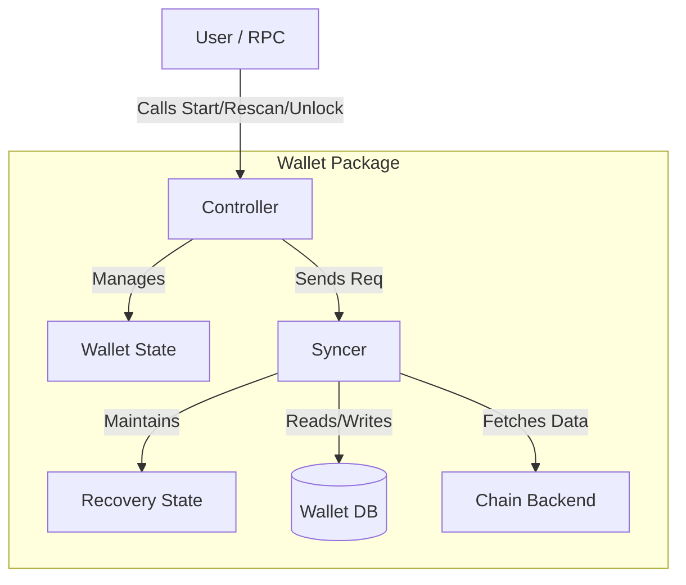

# Wallet Synchronization and Scanning Architecture

This document details the architecture of the `btcwallet` synchronization subsystem. It explains how the wallet maintains consensus with the blockchain, discovers relevant transactions, and manages the recovery of funds.

## 1. High-Level Architecture

The synchronization system is designed around a **Controller-Worker-State** pattern, separating the public API from the background work and the core logic.

### 1.1 Key Components

*   **Controller (`wallet/controller.go`)**: The public face of the wallet. It manages the wallet's lifecycle (`Start`, `Stop`), handles authentication (`Lock`, `Unlock`), and acts as the gatekeeper for state transitions. It does *not* perform blocking chain operations directly.
*   **Syncer (`wallet/syncer.go`)**: A dedicated background worker responsible for the main synchronization loop. It communicates with the chain backend (e.g., `bitcoind`, `neutrino`), orchestrates batch scanning, and handles blockchain reorganizations (rollbacks).
*   **RecoveryState (`wallet/recovery.go`)**: A specialized state machine that encapsulates the logic for *what* to scan for. It manages BIP32 derivation horizons, address lookahead windows, and the set of watched outpoints. It is purely logic and memory-based, decoupled from the I/O mechanisms of the Syncer.

---

## 2. State Management: The Orthogonal Model

To manage concurrency and API availability safely, the wallet employs an **Orthogonal State Model**. Instead of a single monolithic status (e.g., "Syncing"), we track three independent dimensions of state. This decoupling allows for precise representation of complex conditions (e.g., a wallet can be "Started" AND "Syncing" AND "Locked") without state explosion.

### 2.1 Lifecycle (System State)
Tracks the runtime status of the wallet's main event loop and background processes.
*   **Stopped**: The wallet is idle. No background routines are running.
*   **Starting**: The wallet is in the middle of its synchronous startup sequence (e.g., loading accounts, verifying birthday).
*   **Started**: The wallet is fully operational. `mainLoop` and `chainLoop` are running.
*   **Stopping**: A shutdown signal has been sent; the wallet is waiting for background routines to exit.

### 2.2 Synchronization (Chain State)
Tracks data freshness relative to the blockchain backend.
*   **BackendSyncing**: Waiting for the chain backend (e.g., bitcoind) to finish its own synchronization.
*   **Syncing**: The wallet is actively downloading blocks or filters to catch up to the chain tip.
*   **Synced**: The wallet is fully caught up with the current chain tip.
*   **Rescanning**: The wallet is performing a targeted historical scan for specific accounts or addresses. This is a sub-state that does not rewind the global sync watermark.

### 2.3 Authentication (Security State)
Tracks the accessibility of sensitive private key material.
*   **Locked**: Private keys are encrypted and inaccessible in memory.
*   **Unlocked**: Private keys have been decrypted and are available for signing.
*   **Security Note**: The system tracks the `unlocked` flag such that the zero-value (false) defaults to the secure **Locked** state. The wallet is forcefully locked during any `Stop` or `Stopping` transition.

---

## 3. Synchronization Modes

The `Syncer` operates in two primary modes:

### 3.1 Chain Synchronization (Global Sync)
This is the default background process that ensures the wallet maintains consensus with the blockchain.

*   **Goal**: Advance the global `SyncedTo` pointer to the current chain tip.
*   **Mechanism**: Sequential forward scanning of block batches.
*   **Persistence**: Upon successful completion of a batch, the wallet updates its global "sync tip" in the database.

### 3.2 Targeted Rescan (Import Scanning)
Triggered by user actions like importing a new account, a private key, or an XPUB.

*   **Goal**: Discover historical transactions for the *newly added* keys without affecting the synchronization status of existing keys.
*   **Mechanism**: Ad-hoc scanning of a specific block range (typically from the birthday of the imported key to the current tip).
*   **Persistence**: Found transactions are inserted into the database, but the global `SyncedTo` watermark is **not** altered. This allows the wallet to remain "Synced" for the rest of its keys while processing the import in the background.

---

## 4. Data Preparation

Before scanning can begin, the Syncer must prepare a `RecoveryState` object. This object acts as the "Checklist" of things to look for in the blocks. The source of this data depends on the sync mode.

### 4.1 Loading for Global Sync
When performing the standard chain sync, the wallet loads **all** active data from the database:
1.  **Accounts**: Iterates through all active BIP32 accounts in the `waddrmgr`.
2.  **Horizons**: For each account, retrieves the current external and internal branch horizons (the index of the last used address).
3.  **Historical Addresses**: Loads every address that has ever received funds.
4.  **UTXOs**: Loads all unspent transaction outputs to detect spends.

The `RecoveryState` is initialized with this data and immediately derives `N` new lookahead addresses (based on the `RecoveryWindow`) for every account branch.

### 4.2 Loading for Targeted Rescan
When performing a targeted rescan (e.g., after `ImportAccount`), the caller provides specific targets. The wallet constructs a **Partial Recovery State**:
1.  **Targets**: Only the specific accounts or addresses requested by the caller are loaded.
2.  **Isolation**: Existing, fully-synced accounts are **excluded** from this state.
3.  **Efficiency**: This ensures the scanner only spends CPU cycles matching the new keys, ignoring the thousands of keys that are already up-to-date.

---

## 5. Full Block Scanning Algorithm

This is the traditional scanning method, used when bandwidth is abundant or when privacy filters are not supported by the backend.

### 5.1 The Algorithm
1.  **Fetch Batch**: The Syncer requests a batch of full blocks (e.g., 20 blocks) directly from the backend (RPC `getblock` or P2P `MSG_BLOCK`).
2.  **Process Sequentially**: It iterates through each block in memory.
3.  **Transaction Matching**:
    *   **Inputs**: Checked against the `watchedOutPoints` map to detect spends.
    *   **Outputs**: Checked against the `addrFilters` map to detect receives.
4.  **Horizon Expansion**: If a transaction pays to a lookahead address:
    *   Mark address as used.
    *   Derive new lookahead addresses.
    *   **No Restart Needed**: Since we have the full block data, we simply add the new addresses to the map and continue processing. Future blocks in the batch will be checked against the updated map.

---

## 6. CFilter Scanning Algorithm

This method uses BIP 157/158 Compact Filters to minimize bandwidth usage. It is complex because filters are probabilistic and abstract; we don't have the transaction data until we fetch the block.

### 6.1 Optimistic Batch Processing with In-Place Resume
To overcome the latency of fetching headers -> filters -> blocks sequentially, we use an **Optimistic** strategy.

1.  **Parallel Fetch**:
    *   Assume the current lookahead window is sufficient.
    *   Fetch a large batch (e.g., 250 blocks) of **Headers** and **CFilters** in parallel.

2.  **Local Filtering**:
    *   Match the CFilters against the `RecoveryState`'s watchlist (Addresses + Outpoints).
    *   Queue only the *matching* blocks for download.

3.  **Sequential Process & Resume Loop**:
    *   Iterate through the batch.
    *   **Horizon Expansion Event**: If Block `N` contains a payment to a lookahead address, we must expand the window.
    *   **The Problem**: The filters for blocks `N+1` to `End` were checked against the *old* watchlist. They might contain payments to the *new* addresses we just derived.
    *   **The Fix (In-Place Resume)**:
        *   Pause processing.
        *   Update the watchlist with new addresses.
        *   **Re-Match** the filters for the remainder of the batch (`N+1`...`End`) against the new watchlist.
        *   Fetch any *newly* matched blocks.
        *   Resume processing from `N+1`.

---

## 7. Strategy Comparison & Selection

The wallet automatically selects the best strategy based on the environment and state.

| Feature | Full Block Scanning | CFilter Scanning |
| :--- | :--- | :--- |
| **Bandwidth** | High (All data) | Low (Headers + Filters + Matches) |
| **CPU Usage** | Low (Hash map lookups) | High (Elliptic Curve ops + SIPHash matching) |
| **Latency** | Low (Local) / High (Remote) | Low (Parallel Fetch) |
| **Privacy** | Poor (if remote RPC) | Good (Neutrino) |
| **Best For** | Local Bitcoind, Huge Wallets | Mobile, Light Clients, Bandwidth Cap |

### 7.1 Selection Logic (`SyncMethodAuto`)
The wallet uses a heuristic to choose:
1.  **Backend Capability**: If the backend doesn't support BIP 157 (CFilters), fall back to Full Blocks.
2.  **Watchlist Size**: If the wallet is watching > 100,000 items (addresses + UTXOs), CFilter matching becomes CPU-prohibitive. The wallet switches to **Full Block** scanning, as checking a map is O(1) regardless of size.
3.  **Default**: Use **CFilters** for efficiency and privacy.

---

## 8. Performance and Efficiency

*   **Write Batching**: Database writes are the single biggest bottleneck. The Syncer aggregates all findings (transactions, state updates) from a batch and commits them in a **single database transaction**. This reduces disk I/O by orders of magnitude compared to per-block commits.
*   **Lookahead Derivation**: Address derivation is cached. The `RecoveryState` ensures we don't re-derive keys we've already generated, even if the scan is restarted.
*   **Non-Blocking**: All scanning happens in a dedicated goroutine. The Wallet Controller remains responsive to `Info` and `Balance` requests even during a massive re-sync.