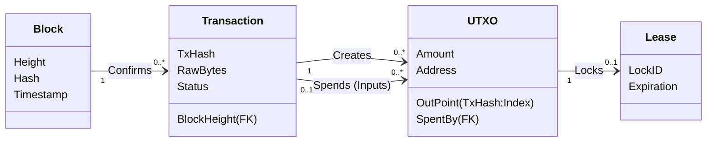
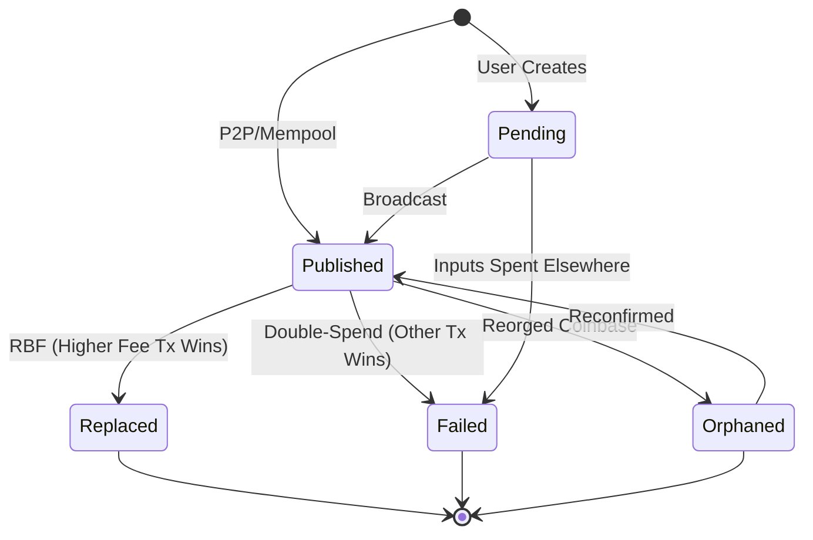
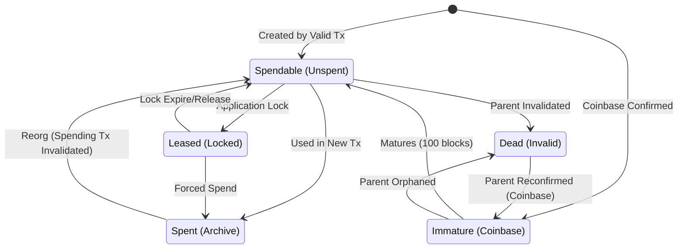
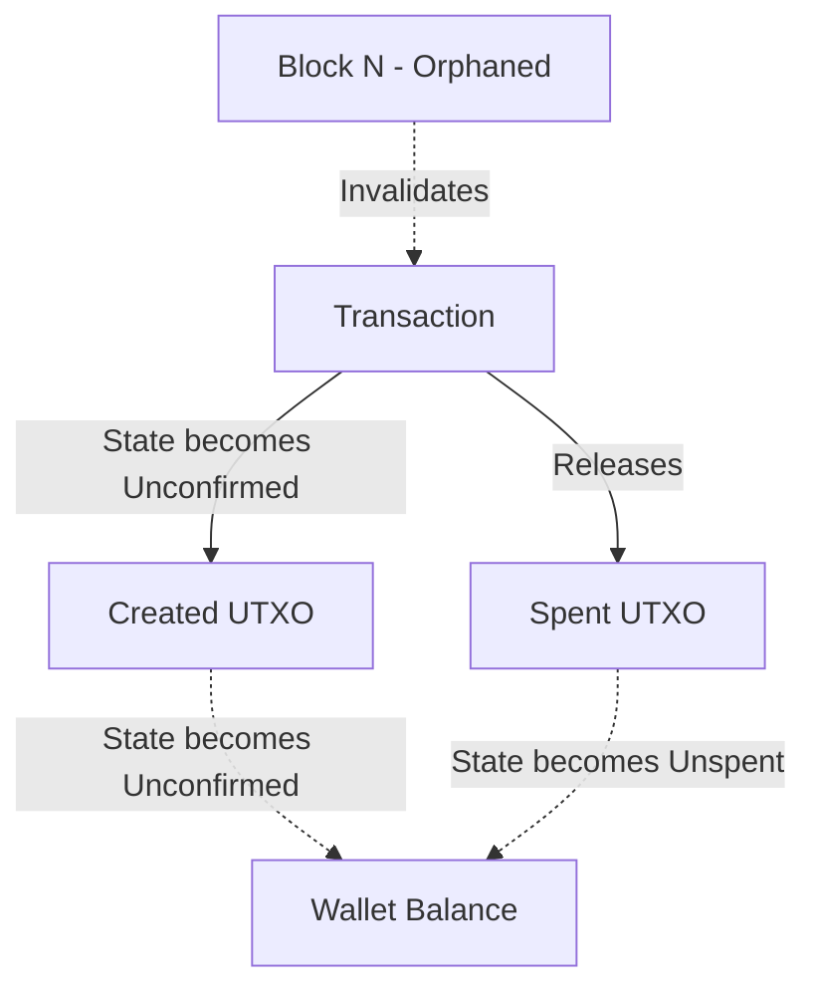
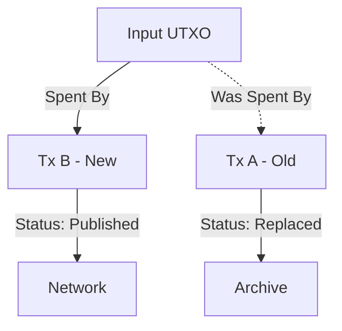
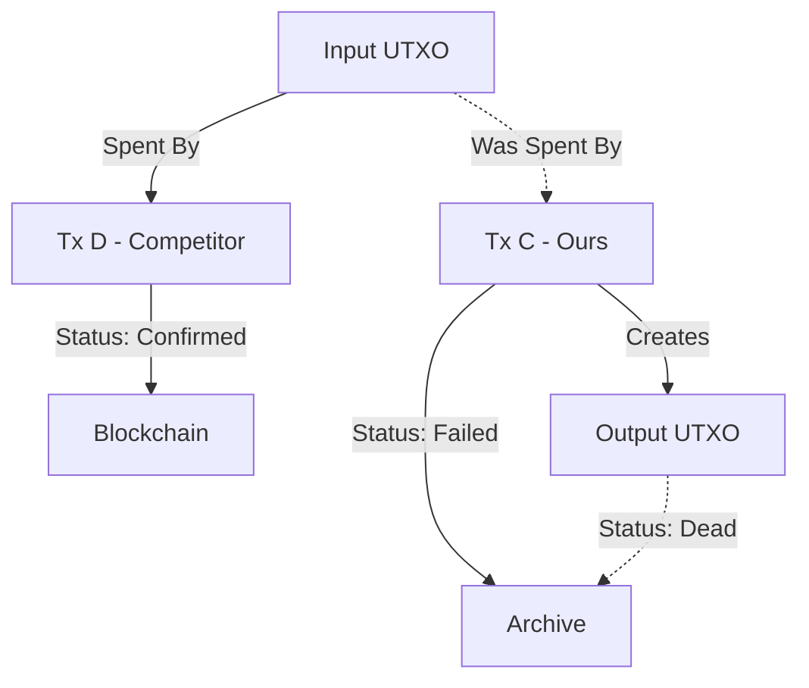

# Wallet Data Model and Lifecycle

This document defines the core data model, state machines, and design philosophy of the `btcwallet` transaction subsystem. It serves as the definitive reference for understanding how the wallet manages money, history, and state.

## 1. Design Philosophy

The `btcwallet` architecture is built upon a specific worldview: **The wallet is a UTXO Manager.**

While Bitcoin users often think in terms of "Balances" and "Transactions," the operational reality of the Bitcoin protocol is the **Unspent Transaction Output (UTXO)**. A wallet's primary responsibility is to discover, secure, and select these outputs for spending.

### 1.1 Structural vs. Operational Centrality

Our data model distinguishes between data integrity and operational efficiency:

*   **Structurally Transaction-Centered:** Data integrity flows from the parent Transaction to the child UTXO. A UTXO cannot exist without a creating transaction. If a transaction is invalid (double-spent), its outputs are invalid.
*   **Operationally UTXO-Centered:** The read path is optimized for UTXOs. 99% of wallet operations (calculating balance, selecting coins for a new payment) query the **UTXO set**, not the transaction history.

### 1.2 The "Immutable History" Policy

We adhere to a strict **"Never Delete History"** policy.
*   **Chain Data is Immutable:** Once a transaction is mined, it happened. We record it.
*   **Intent is Immutable:** If a user attempts a transaction that later fails (e.g., RBF replaced), that attempt is part of the wallet's audit trail.
*   **Soft Deletion:** We do not physically `DELETE` rows. Invalid or replaced transactions are marked with a status (`failed`, `replaced`) so they are ignored by balance calculations but preserved for history.

---

## 2. The Data Model

The wallet state is composed of four primary entities.

Note: This diagram is conceptual and uses natural identifiers like `TxHash` and an outpoint (`TxHash:Index`). The SQL schema uses surrogate keys (for example `transactions.id`) and scopes all `wtxmgr` rows by `wallet_id`.

Mapping (conceptual -> SQL):

| Concept | SQL (example) |
| --- | --- |
| `TxHash` | `transactions.tx_hash` (unique per `wallet_id`) |
| Transaction row ID | `(transactions.wallet_id, transactions.id)` |
| OutPoint (`TxHash:Index`) | `(utxos.wallet_id, utxos.tx_id, utxos.output_index)` |
| Address (address book) | `addresses.id` (address-manager schema) |
| Confirmation | `transactions.block_height` (FK to `blocks(block_height)`) |
| Lease | `(utxo_leases.wallet_id, utxo_leases.utxo_id)` |

### 2.1 Entity Roles

*   **Block:** The anchor for time and confirmation. It handles reorgs. If a block is disconnected, linked transactions automatically lose their confirmation status.
*   **Transaction:** The provenance record. It stores the *intent* (Who sent? When?) and the *status* (Confirmed? Failed?).
*   **UTXO:** The unit of value. This is the "Coin". It is the bridge between transactions.
*   **Lease:** A temporary, memory-like lock on a UTXO to prevent double-spending within the wallet application (e.g., reserving a coin for a Lightning channel open).

---

## 3. Transaction Lifecycle

A Transaction represents an event that *moves* value. Its lifecycle tracks the journey from user intent to blockchain finality.

### 3.1 State Machine

### 3.2 Status vs. Confirmation

We distinguish between a transaction's **Validity** (Status) and its **Confirmation** (Block Height).

**1. Confirmation (Source of Truth: `BlockHeight`)**
*   **Unconfirmed:** `BlockHeight IS NULL`
*   **Confirmed:** `BlockHeight IS NOT NULL` (points to a valid block)

**2. Validity (Source of Truth: `Status`)**

| Status | Meaning | Affects Balance? |
| :--- | :--- | :--- |
| `pending` | Created locally, not yet broadcast. | **No** (Locked) |
| `published` | Active in mempool or blockchain. | **Yes** (If valid) |
| `replaced` | Replaced by a higher-fee transaction (RBF). | **No** |
| `failed` | Invalidated by a conflicting transaction (Double-Spend). | **No** |
| `orphaned` | Coinbase tx that was reorged out (Invalid). | **No** |

*Additional invariant: Coinbase transactions cannot exist in the mempool. A coinbase transaction is either confirmed (`BlockHeight IS NOT NULL` and `Status='published'`) or orphaned (`Status='orphaned'` and `BlockHeight IS NULL`).*

*Note: There is no "Abandoned" state. A broadcast transaction cannot be safely abandoned; it can only be invalidated by double-spending its inputs.*

---

## 4. UTXO Lifecycle

A UTXO represents **spendable potential**. Its state is derived entirely from its parent Transaction and its "Spent By" pointer.

### 4.1 State Machine

### 4.2 Derivation Logic

A UTXO does not store its own status field. Its status is calculated dynamically to ensure consistency.

| UTXO State | Parent Tx Status | `BlockHeight` | `SpentBy` Pointer | Meaning |
| :--- | :--- | :--- | :--- | :--- |
| **Confirmed** | `published` | `NOT NULL` | `NULL` | Available, mature funds. |
| **Unconfirmed** | `published` | `NULL` | `NULL` | Incoming funds, risk of RBF. |
| **Immature** | `published` (Coinbase) | `NOT NULL` | `NULL` | Mined coins, must wait 100 blocks. |
| **Spent** | `published` | `NOT NULL` | `NOT NULL` | History. We used this money. |
| **Dead (Permanent)** | `failed` / `replaced` | *Any* | *Any* | Permanently invalid output from a failed attempt. |
| **Dead (Recoverable)** | `orphaned` (coinbase) | `NULL` | *Any* | Orphaned coinbase output. Can become `Immature` if parent is reconfirmed. |

---

## 5. Operational Behaviors

### 5.1 Reorg Handling (Auto-Healing)

When the blockchain reorganizes (disconnects blocks):
1.  **Block** record is disconnected from the best chain (deleted/replaced).
2.  **Transactions** in that block have their `BlockHeight` set to `NULL`.
3.  **Effect (non-coinbase):** Regular transactions revert to `Unconfirmed` state (but remain `published`).
    *   **Coinbase special case:** Coinbase transactions from the disconnected block are marked `orphaned` (as per ADR 0006) instead of reverting to `Unconfirmed`, since they cannot exist outside of the block that created them.
4.  **Cascading Effect:**
    *   Outputs created by these txs become `Unconfirmed` (except for outputs of `orphaned` coinbase txs, which are no longer considered part of the spendable UTXO set).
    *   Inputs spent by these txs revert to `Unspent` (if the spending tx is completely invalidated).

Implementation note: The SQL `blocks` table models the current best chain. During a disconnect, the best-chain association is removed (for example by deleting the `blocks` row at that height and inserting the new one). The coinbase status update MUST be atomic with clearing `BlockHeight` to avoid an invalid "unconfirmed coinbase" state.

Coinbase reconfirmation note: If an orphaned coinbase transaction re-enters the best chain, restoring it requires updating `BlockHeight` and `Status='published'` atomically (one SQL statement within a transaction) to satisfy coinbase invariants.

Reconfirmation semantics:
*   The transaction keeps the same `tx_hash` and is associated with a new `block_height`.
*   Outputs created by the transaction transition from `Dead (Recoverable)` back to `Immature` (and later become spendable after maturity).

Deep reorg note: A deep reorg is handled as a batch of block disconnects. Implementations should treat this as a bounded, transactional operation (potentially chunked) rather than assuming a single-block example.

### 5.2 RBF (Replace-By-Fee)

When the wallet detects a replacement transaction (Tx B) for an existing unconfirmed transaction (Tx A):
1.  **Detection:** Tx B spends the same inputs as Tx A.
2.  **Update:** The input UTXOs are updated to point to Tx B (`SpentBy = TxB`).
3.  **Archive:** Tx A is marked as `status = 'replaced'`. It remains in the DB for history but is ignored by balance queries.

### 5.3 Upstream Double-Spend (Invalidation)

When a transaction (Tx C) becomes invalid because *its input* was spent by a conflicting transaction (Tx D) that confirmed:
1.  **Detection:** We see Tx D confirmed in a block. It spends UTXO X.
2.  **Conflict:** We have Tx C (unconfirmed) which also spends UTXO X.
3.  **Resolution:**
    *   Update UTXO X: `SpentBy = TxD`.
    *   Mark Tx C: `Status = 'failed'`.
    *   **Cascade:** Any UTXOs created by Tx C are now effectively "Dead" (because their parent is `failed`).
    *   Any transactions spending those dead UTXOs must also be marked `failed` (recursive invalidation).

Architectural consequence: Recursive invalidation can require graph traversal across transaction chains. Typical wallet histories are shallow, but the design should acknowledge worst-case depth and define an execution strategy (batch processing, recursion limits, and/or iterative traversal) to avoid pathological performance.

Suggested implementation strategy:
1.  Start with a queue of newly-invalid transactions (double-spent, replaced, or orphaned).
2.  Mark those transactions `failed`/`replaced`/`orphaned`.
3.  Find UTXOs created by those transactions.
4.  For each such UTXO, find transactions that spend it and enqueue them.
5.  Repeat until the queue is empty.

This can be implemented with an application-side loop (portable across databases) or a database-side recursive CTE (PostgreSQL).

### 5.4 Coin Selection
Coin selection queries focus purely on the UTXO set:
1.  Filter by `SpentBy IS NULL`.
2.  Join Parent Transaction to ensure `Status IN ('published', 'pending')`.
    *   *Note:* Including `pending` allows chaining unbroadcast transactions (Zero-Latency Chaining), but creates a strict dependency: the parent must be broadcast before the child.
    *   This is an advanced feature and should be opt-in for conservative policies.
    *   If confirmation is required (e.g., for safety), add `AND BlockHeight IS NOT NULL`.
3.  Filter out active `Leases`.

Important: The `spendable_utxos` view described in ADR 0006 does not exclude leases (because it depends on the database's current time function and requires a `NOT EXISTS` against `utxo_leases`). Coin selection must explicitly filter `utxo_leases` where `expires_at > CURRENT_TIMESTAMP`.

Transaction reconstruction note: This model optimizes the high-frequency UTXO read path. Reconstructing a full transaction view (inputs/outputs for UI/history) is inherently more join-heavy and should be treated as a lower-frequency, separately optimized read path.

### 5.5 Multi-Wallet Concurrency & Consistency
When multiple wallets share a single database, all `wtxmgr` rows are scoped by `wallet_id` (see ADR 0006). This avoids conflicts and makes correctness properties explicit.

*   **Consistency model:** The system assumes ACID semantics from the database. Reorg handling, status transitions, and lease acquisition must be performed as explicit SQL transactions.
*   **Concurrency primitive:** UTXO leases are the wallet-level lock. Coin selection must exclude leased UTXOs, and lease acquisition should be treated as part of the same atomic unit as input selection.
*   **Coinbase maturity:** Coinbase UTXOs require 100 confirmations. This rule should be enforced in a single, well-defined place (query helper/view + height parameter) to avoid accidental selection of immature funds.

Suggested enforcement: a parameterized query helper or SQL function that takes `current_height` and filters out coinbase UTXOs where `current_height - block_height < 100`.
